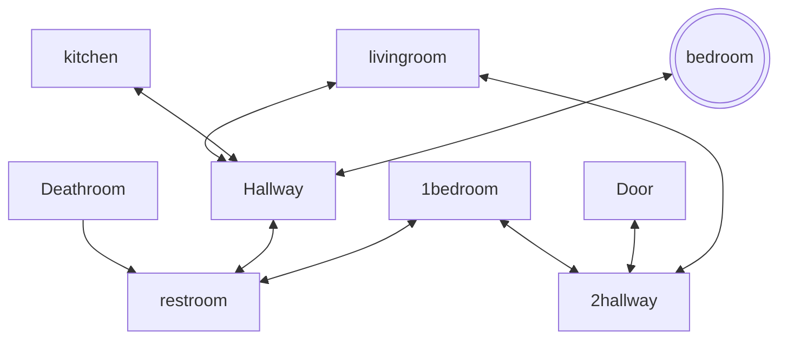

##  Escape the bedroom!

## Setting

You wake up in your bedroom and realize that your house is distored now your trying to find whats going on and how to escape your home before its to late. Then you hear a load bang! and a coutdown to 15 minutes began.

## Map

The player starts on the in their bedroom, and then is directed into the hallway. 
They can explore, but must eventually make their way to locked door.

## Story

When the user gets to where the Door is, they learn that the key is in the restroom they must go to the restroom and get the key and then go back to the Door to escape.

The player has 15 minutes before they lose the game, and each
move costs 1 minute. So this journey must be completed in 15 moves.

## Global Variables

The most important variables are
`nokey` and `havekey`, both
booleans that track progress in the
story. Depending on these two variables,
some rooms will display different things. For example, if you walk into the
door without the key, it will prompt you to
read note which states to get the key and give a hint like "its where everyone goes everyday privately". If you walk in with the key, it will tell you the game has been won and reveal what actually happened.

I also have numeric variables called `day` and `minute` which keep track of 
time. `minute` starts at 0 and counts up
with each move.
